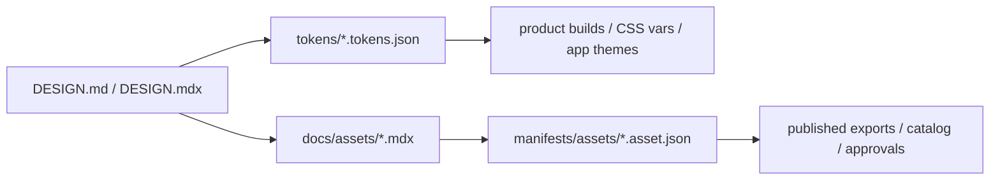

# Enterprise Design Documentation Standard

This repository defines a practical extension of Stitch-style `DESIGN.md` into a broader enterprise standard.

The standard is intentionally hybrid:

1. Markdown for narrative intent, usage rules, and AI context
2. Design tokens for machine-readable design decisions
3. Asset manifests for lifecycle, exports, approvals, and accessibility metadata
4. Generated outputs for apps, websites, DAMs, email systems, social workflows, and print vendors

## Core model



Each layer has a clear job:

- Markdown explains meaning, rationale, constraints, and do/don't guidance.
- Tokens hold reusable values and semantic references.
- Asset manifests define ownership, approval status, variants, export profiles, and accessibility commitments.
- Generated outputs are build artifacts, not source of truth.

## Scope

This standard is meant to cover:

- brand identity
- product UI foundations
- components and UI assets
- iconography
- website and campaign visuals
- social media assets
- email and CRM graphics
- sales and internal communication templates
- print collateral
- packaging and retail artwork
- motion and video
- runtime interactive animation
- documentation diagrams
- photography libraries
- accessibility support artifacts
- governance and release records

## Required repository conventions

Use these paths unless you have a strong reason to diverge:

```text
DESIGN.md
BRAND.md
docs/assets/<family>/<asset>.mdx
tokens/<scope>/*.tokens.json
manifests/assets/<asset>.asset.json
releases/latest/catalog.json
skills/<skill-name>/SKILL.md
```

## Taxonomy

Every non-trivial asset must declare:

- `id`
- `title`
- `assetType`
- `subtype`
- `status`
- `maturity`
- `brand`
- `channels`
- `usageContexts`
- `owners`
- `sourceOfTruth`
- `editableMasters`
- `formatProfiles`
- `accessibility`
- `version`

Recommended lifecycle states:

- `draft`
- `in-review`
- `approved`
- `published`
- `deprecated`
- `retired`

Recommended maturity phases:

- `experimental`
- `beta`
- `ga`
- `deprecated`

## Naming rules

Use semantic IDs and descriptive filenames.

Canonical asset IDs:

```text
brand.logo.primary.horizontal
marketing.social.linkedin.company-banner.default
motion.loader.primary.default
```

Published filenames:

```text
<org>-<asset-type>-<identifier>-<variant>-<theme>-<context>-v<semver>.<ext>
```

Examples:

```text
acme-logo-primary-horizontal-light-rgb-v2.1.0.svg
acme-social-linkedin-company-banner-light-1584x396-en-us-v1.3.0.png
acme-motion-loader-primary-light-2s-reduced-v1.0.2.lottie
```

## Tokens

Use three layers:

- raw tokens such as `color.blue.600`
- semantic tokens such as `color.background.brand.default`
- component or channel tokens such as `button.primary.background.default`

Token files should be DTCG-compatible wherever practical.

## Asset docs

Asset pages should use YAML front matter plus predictable sections.

Minimum sections:

- `Purpose`
- `Approved usage`
- `Do not use`
- `Variants`
- `Exports`
- `Accessibility`
- `Governance`
- `Changelog`

## Accessibility baseline

Default digital conformance target: `WCAG 2.2 AA`.

Each asset family must define the relevant checks:

- logos and icons: contrast, minimum size, decorative vs informative usage
- social and marketing graphics: safe crop, readable embedded text, alt-text guidance
- motion: reduced-motion fallback, poster frame, captions when narrative
- digital PDFs: tagging, reading order, headings, contrast
- responsive web assets: breakpoint coverage, dark-mode review, file-size budgets

## Governance

Use Git and pull requests as the release control plane.

Required controls:

- schema validation in CI
- catalog generation in CI
- ownership routing through `CODEOWNERS`
- SemVer for assets and standard changes
- changelog entries for meaningful changes

SemVer guidance:

- `MAJOR`: breaking rename or asset replacement
- `MINOR`: new approved variant, new locale, new export, new channel
- `PATCH`: metadata fix, non-breaking re-export, annotation correction

## Migration pattern

To migrate a Stitch-only system:

1. Keep the original `DESIGN.md`.
2. Extract reusable values into tokens.
3. Create manifests for priority assets.
4. Add per-asset docs for approved families.
5. Add CI validation and publish a machine-readable catalog.
6. Deprecate untracked exports after a fixed dual-run period.

## Success criteria

This standard is working when:

- humans can read and approve it quickly
- agents can use it without guessing
- code and creative tooling consume the same source of truth
- CI catches broken references before release
- asset history, ownership, and accessibility obligations are explicit
