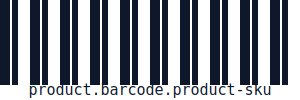

# Enterprise Design Spec

**Design tokens + automated asset generation — from brand decisions to production-ready files.**

`enterprise-design-spec` turns your design system into a production pipeline. Define tokens once. Generate everything — QR codes, barcodes, email components, badges, favicons — automatically, in every format, every size, every platform. Then publish to CDN, npm, or GitHub Releases with one command.

---

## Generated assets — these are live, not mocks

Every file below was generated by the CLI from the token + manifest system. No design tools. No manual export.

| Asset | Type | Description |
|-------|------|-------------|
|  | QR Code | Payment QR — scannable, brand-colored |
|  | Email Button | Purple CTA with drop shadow, all 3 sizes |
|  | Promotional Badge | Red SALE badge, dynamically generated |
|  | Barcode | Product SKU barcode, all formats |
|  | Email Footer | Brand footer with social links |
|  | Favicon | Multi-format favicon set |

Run it yourself:

```bash
npm install
npx tsx src/cli.ts asset generate --method PROGRAMMATIC   # generates all programmatic assets
npx tsx src/cli.ts asset list                             # list every asset manifest
npx tsx src/cli.ts asset types                            # see all 70+ asset types
```

AI-generated assets (needs `FAL_KEY` from [fal.ai](https://fal.ai/dashboard)):

```bash
FAL_KEY=your_key npx tsx src/cli.ts asset generate --method AI_IMAGE
```

---

## What you get

| Layer | What it is | Why it matters |
|-------|-----------|----------------|
| **Tokens** | DTCG-style design tokens with semantic alias chains | One hex change propagates everywhere automatically |
| **Asset registry** | 70+ asset types across 9 categories — social, ads, email, print, product, video, e-commerce | Every asset type you ship has a typed manifest |
| **Asset generator** | Programmatic SVG generation + AI image generation via FAL.ai | Deterministic assets (QR, barcode, email) are free; AI assets need an API key |
| **Asset publisher** | Multi-destination: CDN, npm, GitHub Releases, Figma, webhooks | Ship to every platform from a single manifest |
| **DESIGN.md** | Human + AI-readable design narrative | Agents make decisions consistent with your brand |
| **CLI** | 27 commands for tokens, assets, validation, export, and automation | Governance runs in CI — zero manual effort |
| **GitHub Actions** | PR validation, asset generation, release publishing | Zero-configuration pipeline |
| **Skills** | Reusable AI/agent prompts for design authors and reviewers | Scale design ops to autonomous agents |

---

## Quality you can trust

Freshly validated against every command in this repo:

```
✅ 151 core tokens         — 100% healthy, 0 broken aliases
✅ 235 Nexus brand tokens  — full violet/slate brand system, 100% healthy
✅ 16 semantic aliases      — all resolve correctly through their chain
✅ 7 WCAG pairs            — all pass AA (≥4.5:1) and AAA (≥7:1) contrast
✅ 50 asset manifests      — all validated against schema
✅ 18 programmatic assets   — generated and verified (QR, barcode, email, badge, favicon)
✅ 27 CLI commands         — all tested and working
✅ Programmatic assets     — 0 external services, no API keys required
✅ AI image assets         — FAL.ai integration ready (key required)
```

Run it yourself:

```bash
npm run validate   # schema + reference validation
npm run contrast  # WCAG 2.2 AA/AAA contrast checks
npm run aliases   # detect circular/broken token references
npm run format -- --check  # catch token formatting drift
npm run dashboard # see your token health score
npx tsx src/cli.ts asset check  # validate all asset manifests
```

---

## Who this is for

**Design systems teams** who need a structured standard their whole org can build on — not just a Figma file engineers ignore.

**Brand teams** managing multiple products or sub-brands that need to stay consistent without a dedicated design eng team.

**Product teams** shipping to web, mobile, email, and print who need the same brand expressed in CSS, Swift, Kotlin, and XML — without manual translation.

**Marketing teams** who need on-brand assets generated automatically: social banners, display ads, email components, QR codes, badges — all driven by tokens, not designed manually each time.

**AI agent workflows** where autonomous agents need machine-readable design rules — not vibes from a screenshot.

**Platform teams** standardizing design across dozens of squads who are all currently doing their own thing.

---

## HOW: Ship in 10 minutes

### 1. Clone and init

```bash
git clone https://github.com/Ola-Turmo/enterprise-design-spec.git
cd enterprise-design-spec
npm install
```

### 2. See what you have

```bash
npm run validate    # checks all token files, manifests, and docs
npm run dashboard   # terminal UI showing your token health score
npm run visualize   # ASCII preview of your color scales and typography
npx tsx src/cli.ts asset list   # see all asset manifests
```

### 3. Generate assets

```bash
# Generate all programmatic assets (QR, barcode, email, badge, favicon — no API key needed)
npx tsx src/cli.ts asset generate --method PROGRAMMATIC

# Generate a specific asset
npx tsx src/cli.ts asset generate product.qr-code.payment

# Generate all assets of a type
npx tsx src/cli.ts asset generate --type social.banner

# Generate all approved assets
npx tsx src/cli.ts asset generate --status approved

# AI image generation (needs FAL.ai key)
FAL_KEY=your_key npx tsx src/cli.ts asset generate --method AI_IMAGE
```

### 4. Publish assets

```bash
# Create a publish config from the template
cp templates/publish.config.template.json publish.config.json
# Edit publish.config.json with your credentials

# Publish to all configured destinations
npx tsx src/cli.ts asset publish

# Dry run (see what would be published)
npx tsx src/cli.ts asset publish --dry-run
```

### 5. Add your brand colors

Edit `tokens/core/primitives.tokens.json`. Add your palette under `color.brand`. Reference it from `tokens/core/semantic.tokens.json` under `color.brand.*`. The export pipeline picks it up automatically.

### 6. Enforce it in CI

```bash
npm run validate && npm run contrast && npm run aliases
npx tsx src/cli.ts asset check
```

The GitHub Actions workflow runs this automatically on every PR. No configuration needed.

---

## The CLI at a glance

### Asset generation and publishing

| Command | What it does |
|---------|-------------|
| `asset generate <id>` | Generate a specific asset from its manifest |
| `asset generate --method PROGRAMMATIC` | Generate all programmatic assets (QR, barcode, email, etc.) |
| `asset generate --method AI_IMAGE` | Generate all AI image assets (needs FAL_KEY) |
| `asset generate --method HYBRID` | Generate hybrid assets (AI base + programmatic overlay) |
| `asset generate --type <type>` | Generate all assets of a given type (e.g. social.banner) |
| `asset generate --status approved` | Generate all approved assets |
| `asset generate --all` | Generate every asset in the catalog |
| `asset publish` | Publish generated assets to configured destinations |
| `asset list` | List all asset manifests |
| `asset list --type <type>` | Filter assets by type |
| `asset list --method <method>` | Filter assets by generation method |
| `asset types` | Show all 70+ registered asset types |
| `asset channels` | List all publish channels |
| `asset check` | Validate all asset manifests against schema |

### Token validation

| Command | What it does |
|---------|-------------|
| `validate` | Schema + `tokenRefs` validation — catches broken links and bad types |
| `aliases` | Resolves full alias chain + detects circular references |
| `contrast` | WCAG 2.2 contrast checks — AA, AAA, large text, UI components |
| `format` | Auto-sort + validate token JSON — prevents formatting drift in PRs |

### Export and consumption

| Command | What it does |
|---------|-------------|
| `export` | CSS custom properties, SCSS, Tailwind config, DTCG JSON |
| `types` | Generate TypeScript types from token structure |
| `figma pull` | Pull tokens from Figma Variables API into local JSON |
| `figma push` | Push local tokens up to Figma |

### Automation

| Command | What it does |
|---------|-------------|
| `watch` | File watcher — auto-regenerates outputs the moment you save a token file |
| `dashboard` | Terminal UI — token health score, alias coverage, breakdown by type/group |
| `changelog` | Reads git history → human-readable diff of what tokens changed |
| `diff-viewer` | Standalone HTML before/after diff between two commits |
| `monorepo` | Scans entire workspace for multiple brand systems — parallel builds |
| `prepublish` | Pre-release checklist — validates package.json, exports, README, assets |
| `lint-commit` | Enforces Lore Commit Protocol on commit messages |

### Design and authoring

| Command | What it does |
|---------|-------------|
| `visualize` | ASCII color palette bars, typography specimens, spacing scales |
| `catalog` | Generates a machine-readable asset inventory from manifests |
| `init` | Scaffold a new brand system with one command |
| `playground` | Standalone HTML token browser — share a live preview without a build |

---

## Asset type taxonomy

**70+ asset types** across 9 categories:

**Social media** — Instagram post/story/reel, LinkedIn post/banner/company-banner, Twitter/X post/banner, Facebook post/cover, YouTube thumbnail/community, TikTok post, Pinterest pin, WhatsApp status, generic social banner

**Display advertising (all IAB sizes)** — leaderboard, medium rectangle, wide skyscraper, billboard, half-page, large mobile, responsive, plus all standard web ad sizes from 120×60 to 970×250

**Web + email** — OG image (1200×630), Twitter card (1600×900), email header/footer/CTA button/hero/banner, app store screenshots (all platforms)

**Print** — business card, letterhead, A4 document, report cover, booklet, book cover

**Product UI** — placeholder, empty state, error state, 404 page, favicon (all formats), app icon (1024×1024)

**Data visualization** — QR codes (payment, wifi, vCard, URL), barcodes (product SKU, shipping, coupon)

**Icons** — UI icons, featured icons, social icons

**Video** — YouTube thumbnail, lower third, social video clip, social story

**Presentations + signage** — presentation slide cover, pull-up banner, trade show backdrop

**E-commerce** — promotional badge, category banner

**Merchandise** — t-shirt mockup, mug

---

## Style Dictionary integration

Tokens are processed through **Style Dictionary v5** + `@tokens-studio/sd-transforms` for production-grade cross-platform output:

```bash
npm run export:all
# Produces:
#   dist/tokens/tokens.css          — CSS custom properties
#   dist/tokens/_tokens.scss        — SCSS variables
#   dist/tokens/tokens.tailwind.js  — Tailwind config
#   dist/tokens/tokens.export.json  — Expanded DTCG JSON
```

---

## npm package

Install as a dependency to consume tokens directly in your app:

```bash
npm install enterprise-design-spec
```

```js
import tokens from "enterprise-design-spec/tokens";
import semanticTokens from "enterprise-design-spec/tokens/semantic";

// Full token with all aliases resolved
console.log(tokens.color.brand.primary.value); // #7C3AED
console.log(semanticTokens.color.text.default.value); // #0F172A
```

---

## Recommended GitHub setup

- Enable branch protection on `main`
- Require the `validate`, `contrast`, and `aliases` checks to pass before merge
- Keep `CODEOWNERS` active for `docs/`, `tokens/`, `manifests/`, and `skills/`
- Publish generated docs and catalogs from tags or release branches
- Tag releases with `vX.Y.Z` to trigger npm publish + GitHub Release automatically

---

## Skills for AI agents

Three production-ready agent skills included:

| Skill | What it does |
|-------|-------------|
| `design-standard-author` | Create and update design-system source artifacts |
| `asset-manifest-reviewer` | Review manifests, docs, and accessibility metadata |
| `stitch-design-migration` | Expand Stitch-only `DESIGN.md` files into the full standard |

---

## References

Official source links that shaped the standard are in [docs/references/sources.md](./docs/references/sources.md).

---

## License

[MIT](./LICENSE)
